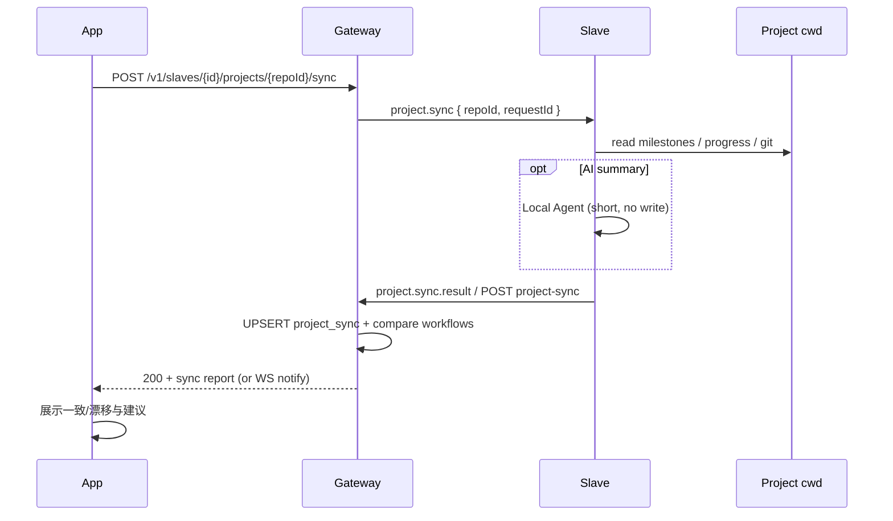

# 工程状态同步（Project Sync）

**状态：Gateway API + 对账 warnings 已落地（M08-P01～P03）；App UI / 可选 AI 摘要见后续 phase**  
目的：让 Gateway 侧工作流状态与各 Slave 工作区（git / progress / milestone）可对账，避免「本机已推进、Gateway 仍停在旧节点」或反之。

相关：

- 持久化：[gateway/docs/state-persist.md](../gateway/docs/state-persist.md)（`project_sync` 表已预留）
- 导航：App `Slave → 工程 → Milestone → 执行 plan`
- 多机多分支：一 Slave 进程 ↔ 一 cwd ↔ 一分支（见下文约束）

---

## 问题

| 真相源 | 存什么 | 容易漂移的场景 |
|--------|--------|----------------|
| **Gateway（SQLite）** | Workflow / 节点 status / Diff / Review | 换机、手改仓库、重建 Workflow、只 Approve 一部分 |
| **工程磁盘** | `ai/milestones.json`、`progress.md`、git commits / 当前分支 | IDE 手改、另一台电脑推代码、跳过 App 直接 commit |

同步**不是**自动改代码或自动 Approve，而是：

1. Slave 采集本机工程快照（结构化 + AI 摘要）  
2. 上报 Gateway 写入 `project_sync`  
3. App 展示「本机 vs Gateway」差异，供人决定续跑 / 重建 / 忽略  

---

## 用户路径

```text
App: Slave 列表 → 某工程
         │
         ├─ [同步]  ← 本功能入口
         └─ → Milestone 列表 → …
```

1. 用户点 **同步**（工程页；Slave 须 online）  
2. Gateway 通知对应 Slave：`project.sync`（带 `repoId`）  
3. Slave 在白名单 `cwd` 内采集 +（可选）短跑 Local Agent 写摘要  
4. Slave `POST /v1/project-sync`（或 WS `project.sync.result`）  
5. Gateway 落库 `project_sync`，并计算与现有 Workflow 的 **diff 提示**  
6. App 展示结果：一致 / 警告 / 建议动作  

---

## 架构



原则：

- **CURSOR_API_KEY 不出 Slave**；摘要只在本机生成  
- Slave **只读采集**（默认可禁止 Agent 改文件；可用 stub/启发式无模型）  
- Gateway 仍是 Workflow **权威**；`project_sync` 是 **对照快照**，不直接改写节点 status（除非后续单独做「按 progress 修复」且显式确认）  

---

## 采集内容（Slave）

对 `projects[].id == repoId` 的 cwd：

| 字段 | 来源 | 说明 |
|------|------|------|
| `branch` | `git rev-parse --abbrev-ref HEAD` | 多分支场景关键 |
| `head` | `git rev-parse HEAD` | 短 SHA 亦可 |
| `dirty` | `git status --porcelain` | 是否有未提交 |
| `milestonesIndex` | `projects[].index` JSON | 与 register 时类似 |
| `progress` | `progressDoc` 解析 | phaseId → pending/done/@approved |
| `recentCommits` | `git log -n 10 --oneline` | 可选 |
| `summary` | AI 或规则模板 | 给人看的 3～8 句中文/英文摘要 |
| `syncedAt` | Slave 本地 UTC | ISO8601 |

**AI 职责（可选但推荐）：**

- 输入：progress 表、最近 commit、当前 branch、未提交文件名列表（勿塞整仓 diff）  
- 输出：`summary` + 可选 `inferredPhaseStatus[]`（AI 猜测，**仅提示**）  
- 禁止：写盘、push、改 progress、改 Gateway 节点  

无 API Key / `--stub`：仅结构化字段 + 规则摘要（如「progress 中 N 项 checked」）。

---

## Gateway 存储（SQLite）

表（已建）：

```sql
CREATE TABLE IF NOT EXISTS project_sync (
  slave_id TEXT NOT NULL,
  repo_id TEXT NOT NULL,
  synced_at TEXT NOT NULL,
  summary_json TEXT NOT NULL,  -- 完整 ProjectSyncPayload
  PRIMARY KEY (slave_id, repo_id)
);
```

`summary_json` 建议 schema：

```json
{
  "schemaVersion": 1,
  "requestId": "req_xxx",
  "slaveId": "slave_pc1_a",
  "repoId": "r_chat_feat_a",
  "cwd": "E:/wt/flutter-chat-feat-a",
  "branch": "feat-a",
  "head": "abc1234",
  "dirty": false,
  "progressDoc": "ai/progress.md",
  "phases": [
    { "id": "M01-P01", "progressStatus": "approved", "title": "…" }
  ],
  "activeWorkflows": [],
  "summary": "M01-P01 已在 progress 勾选；工作区干净；分支 feat-a。",
  "warnings": ["gateway workflow wf_… still has M01-P01=ready"]
}
```

`warnings` 可由 **Gateway 在收到结果后**对比生成（不必全靠 AI）：

| 条件 | 警告示例 |
|------|----------|
| progress 已 approved，但最新 active Workflow 同 phase 仍为 `ready`/`pending` | 本机进度超前 Gateway |
| Gateway 节点 `approved`，progress 仍 pending | Gateway 超前 / progress 未写回 |
| 无 active Workflow，但 progress 有未完成 phase | 可「继续」或「新建」Milestone |
| `dirty == true` | 有未提交变更，Diff 基线可能不稳 |
| branch 与预期命名不符（可选策略） | 提醒用户是否绑错 cwd |

对比对象：该 `slaveId + repoId` 下、`bundleId` 形如 `milestone:*` 的 **最新 active** Workflow（与 App 续跑逻辑一致）。

---

## HTTP / WS 草案

### App → Gateway

`POST /v1/slaves/{slaveId}/projects/{repoId}/sync`  
Bearer；Slave 须 online。

```json
{ "requestId": "optional-uuid" }
```

→ `202`  

```json
{
  "requestId": "req_xxx",
  "status": "accepted"
}
```

离线 → `409` / `503`：`slave offline`。

### Gateway → Slave（WS）

```json
{
  "type": "project.sync",
  "requestId": "req_xxx",
  "repoId": "r_chat_feat_a"
}
```

### Slave → Gateway

优先 HTTP（与 task.event 解耦）：

`POST /v1/project-sync`  
Bearer（与 Slave 同一 token 或专用；首版可复用 App/Slave 已有 Bearer）

```json
{
  "requestId": "req_xxx",
  "slaveId": "slave_pc1_a",
  "repoId": "r_chat_feat_a",
  "payload": { "...ProjectSyncPayload..." }
}
```

或 WS：`type: project.sync.result` + 同上字段。

### 查询

`GET /v1/slaves/{slaveId}/projects/{repoId}/sync`  
→ 最近一次 `project_sync` 行 + Gateway 现算的 `warnings[]`。

`GET /v1/slaves/{slaveId}/projects/{repoId}/sync/report`（可选）  
→ 专供 UI 的对账视图（progress phases × workflow nodes 并排）。

---

## App UI（工程页）

在 **工程列表项** 或进入工程后的 AppBar：

| 控件 | 行为 |
|------|------|
| **同步** | 触发 POST sync；loading；完成后 SnackBar / 底栏报告 |
| 最近同步 | 展示 `syncedAt`、branch、dirty、摘要一行 |
| 警告列表 | 可点进「建议：继续 Workflow wf_… / 查看 progress」 |

**不做（本功能范围外）：**

- 一键把 Gateway 节点改成与 progress 一致（若要做，须二次确认 + 审计）  
- 跨 Slave 合并多分支进度  
- 自动 git push / 开 PR  

---

## 多机多分支

```text
slave_pc1_a + r_chat_feat_a  →  project_sync 主键一行
slave_pc1_b + r_chat_feat_b  →  另一行
```

下班合主干仍是人用 git；同步只保证 **「这台机器这个 cwd」** 与 Gateway 对该 `(slaveId, repoId)` 的 Workflow 可对账。

---

## 安全

- `repoId` 必须在该 Slave 白名单内；cwd 不可由 App 传入  
- 上报 payload 限大小（建议 summary_json &lt; 256KB）  
- 审计：`project.sync` accept / result（无 token、无 API Key、无整段源码）  
- AI 只读；失败时降级为无摘要的结构化同步  

---

## 实现分期（建议）

与 roadmap **[M08](./roadmaps/cloud-agent/milestones/M08-project-sync.md)** 对齐：

| 设计 | Phase | 内容 |
|------|-------|------|
| P0 | （已完成） | SQLite `project_sync` 表预留 |
| P1 | [M08-P01](./roadmaps/cloud-agent/phases/M08-P01-gateway-sync-api.md) + [M08-P02](./roadmaps/cloud-agent/phases/M08-P02-slave-collect.md) | 触发、采集、落库 |
| P2 | [M08-P03](./roadmaps/cloud-agent/phases/M08-P03-reconcile-report.md) + [M08-P04](./roadmaps/cloud-agent/phases/M08-P04-app-sync-ui.md) | 对账 warnings + App UI |
| P3 | [M08-P05](./roadmaps/cloud-agent/phases/M08-P05-ai-summary.md) | 可选 AI 摘要 |
| P4 | （未单列 phase） | 「按 progress 修复」显式操作 — 另开里程碑或增补 phase |

---

## 非目标

- 不替代 Approve / progress.md 写回路径  
- 不把 Redis 引入本功能  
- 不同步 `CURSOR_API_KEY`、pair token、完整 unified diff 到 Gateway（Diff 仍走现有 node diff API）  
